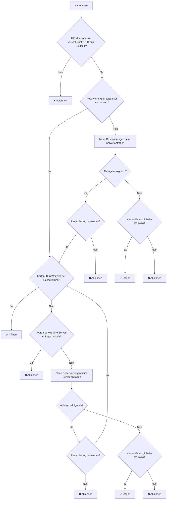

# Brainstroming 2026-02-25

## Datenmodell

- 1 Verein → n Mitglieder
- 1 Mitglied → n Nutzer
- 1 Nutzer → 1 Login/Email
- 1 Nutzer → 1 Karten-ID
- 1 Nutzer → n Mitglieder (⇒ n Mitglieder ↔ n Nutzer)

## Prozess

## Entscheidung / Festlegungen
- Der Verein kann Nutzer hinzufügen; das Mitglied kann dies nicht selbst machen.
- Die Mitgliedsnummer auf der Karte wird absichtlich ignoriert, da somit eine Karte auch bei mehreren Mitgliedern über mehrere Vereine verwendet werden kann (Usability).
- Alle Vereine codieren die Karten mit dem gleichen Schlüssel, denn beim Aussperren wird die UID der Karte in Kombination mit der Buchung geprüft.
- Reservierungen werden immer nur für den nächsten Tag lokal gespeichert.
- Bei jeder Reservierung wird neben Start und Ende noch eine Liste der berechtigten Karten-IDs mitgeliefert.
- Die globale Whitelist wird einmal im Monat komplett übermittelt (Einsparen von Löschzyklen im Flash-Speicher).
- Die globale Whitelist wird täglich inkrementell aktualisiert.
- Die globale Whitelist umfasst alle Karten-IDs aller Vereine.
- Eine Blacklist wird nicht umgesetzt, da gelöschte Karten aus der Whitelist verschwinden.