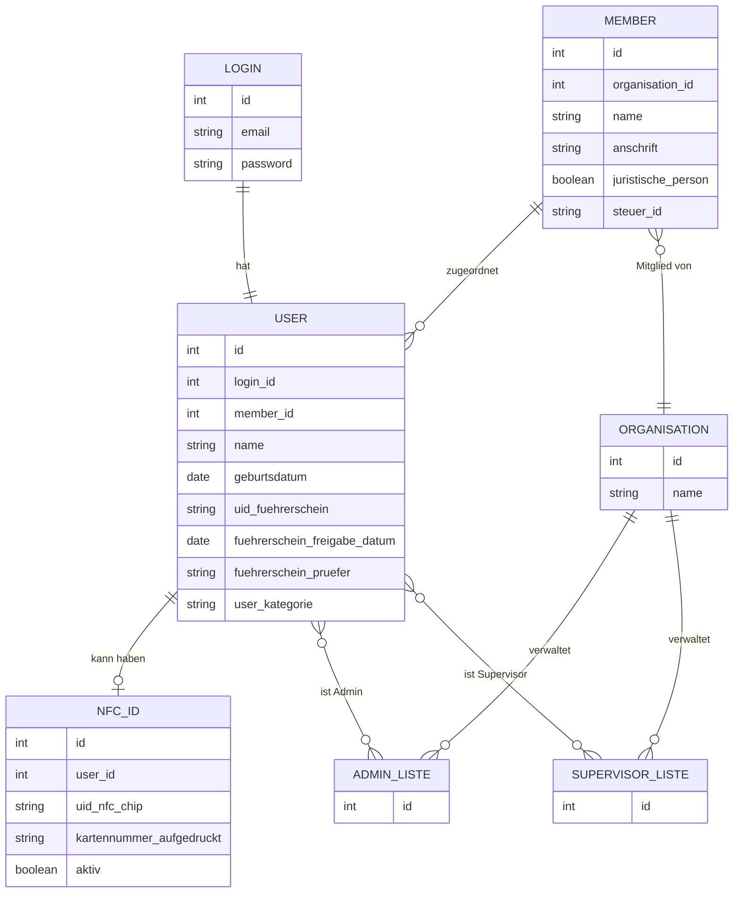

## Themenüberblick

Das Datenmodell wird grundlegend umstrukturiert, um eine klare Trennung zwischen Login-Daten, Nutzerdaten und Führerschein-Berechtigungen zu schaffen. Login-Informationen (E-Mail/Passwort) sollen vereinsunabhängig verwaltet werden, während Führerscheinprüfungen vereinsspezifisch bleiben müssen, da jeder Verein die Fahrberechtigung eigenständig kontrollieren muss. Die Berechtigungsstruktur wird von der Member-Ebene auf die Organisation-Ebene verschoben, wobei Admin- und Supervisor-Rechte über vereinsspezifische User-Listen verwaltet werden. Für Stammdaten wird auf komplexe Historisierung verzichtet und stattdessen eine einfache Überschreibung mit optionalem Logging implementiert, da Änderungen selten auftreten und die Systemkomplexität reduziert werden soll.

**Schlagworte:** Datenmodell, Login-Trennung, Führerschein-Berechtigung, Berechtigungskonzept, User-Listen, Stammdaten, Historisierung, Logging, PostgreSQL, Vereinsspezifisch

## Datenmodell

### Entitäten & Beziehungen

### Feldbeschreibungen

**LOGIN**

| Feld | Typ | Beschreibung | Anmerkung |
|------|-----|--------------|-----------|
| id | int | Primärschlüssel | |
| email | string | E-Mail-Adresse für Login | |
| password | string | Passwort | |

**USER**

| Feld | Typ | Beschreibung | Anmerkung |
|------|-----|--------------|-----------|
| id | int | Primärschlüssel | |
| login_id | int | Verweis auf Login-Tabelle | Optional, nur wenn User sich einloggen kann |
| member_id | int | Verweis auf Member-Tabelle | |
| name | string | Name des Users | Bei juristischen Personen kann das "Karte 1", "Karte 2" etc. sein |
| geburtsdatum | date | Geburtsdatum | Optional, nur bei natürlichen Personen |
| uid_fuehrerschein | string | Führerscheinnummer oder Kartennummer | |
| fuehrerschein_freigabe_datum | date | Datum der Führerscheinfreigabe | Ersetzt separate Führerscheinfreigabe-Tabelle |
| fuehrerschein_pruefer | string | Wer hat den Führerschein geprüft | Ersetzt separate Führerscheinfreigabe-Tabelle |
| user_kategorie | string | Kategorie des Users | "natuerliche_person", "juristische_person_karte", "juristische_person_fahrberechtigter", "juristische_person_login" |

**MEMBER**

| Feld | Typ | Beschreibung | Anmerkung |
|------|-----|--------------|-----------|
| id | int | Primärschlüssel | |
| organisation_id | int | Verweis auf Organisation-Tabelle | |
| name | string | Name des Mitglieds | |
| anschrift | string | Anschrift des Mitglieds | Verschoben vom User zum Member |
| juristische_person | boolean | Kennzeichnung ob juristische Person | |
| steuer_id | string | Steuer-ID bei juristischen Personen | Optional, für zukünftige Abrechnungsfunktionen |

**ORGANISATION**

| Feld | Typ | Beschreibung | Anmerkung |
|------|-----|--------------|-----------|
| id | int | Primärschlüssel | |
| name | string | Name der Organisation/des Vereins | |

**NFC_ID**

| Feld | Typ | Beschreibung | Anmerkung |
|------|-----|--------------|-----------|
| id | int | Primärschlüssel | |
| user_id | int | Verweis auf User-Tabelle | |
| uid_nfc_chip | string | UID des NFC-Chips | Nicht eindeutig - gleiche UID kann bei mehreren Usern vorkommen |
| kartennummer_aufgedruckt | string | Auf Karte aufgedruckte Nummer | Für manuelle Identifikation |
| aktiv | boolean | Ob die NFC-ID aktiv ist | Gesperrte Karten haben aktiv=false |**ADMIN_LISTE**

| Feld | Typ | Beschreibung | Anmerkung |
|------|-----|--------------|----------|
| id | int | Primärschlüssel | Vereinsspezifische Admin-Berechtigung |

**SUPERVISOR_LISTE**

| Feld | Typ | Beschreibung | Anmerkung |
|------|-----|--------------|----------|
| id | int | Primärschlüssel | Vereinsspezifische Supervisor-Berechtigung |

## Quellen

| Datum | Thema | Transkript |
|-------|-------|------------|
| 2026-04-02 | Datenmodell | [Transkript](../../../.doku-arbeitsbereich/2026-04-02_Abstimmung-2026-04-02/transkript/transkript_2026-04-02.md) |
| 2026-04-13 | Datenmodell | [Transkript](../../../.doku-arbeitsbereich/2026-04-13_Abstimmung-2026-04-13/transkript/transkript_2026-04-13.md) |
| 2026-05-21 | Datenmodell | [Transkript](../../../.doku-arbeitsbereich/2026-05-21_Abstimmung-2026-05-20/transkript/transkript_2026-05-21.md) |
