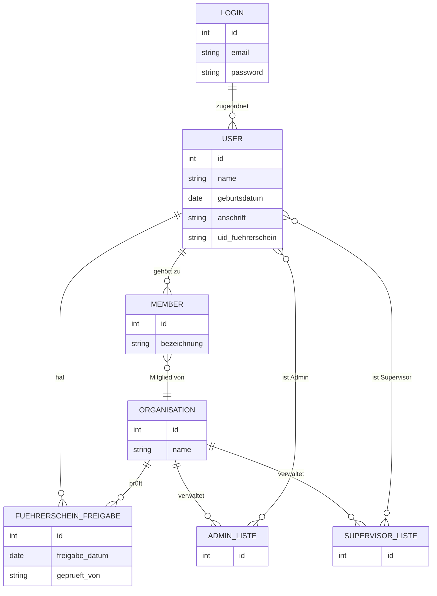

---
thema: Datenmodell
typ: sonstiges
kategorie: allgemein
schlagworte: []
letzte_aktualisierung: 2026-05-14
---

## Themenüberblick

Das Datenmodell wird grundlegend umstrukturiert, um eine klare Trennung zwischen Login-Daten, Nutzerdaten und Führerschein-Berechtigungen zu schaffen. Login-Informationen (E-Mail/Passwort) sollen vereinsunabhängig verwaltet werden, während Führerscheinprüfungen vereinsspezifisch bleiben müssen, da jeder Verein die Fahrberechtigung eigenständig kontrollieren muss. Die Berechtigungsstruktur wird von der Member-Ebene auf die Organisation-Ebene verschoben, wobei Admin- und Supervisor-Rechte über vereinsspezifische User-Listen verwaltet werden. Für Stammdaten wird auf komplexe Historisierung verzichtet und stattdessen eine einfache Überschreibung mit optionalem Logging implementiert, da Änderungen selten auftreten und die Systemkomplexität reduziert werden soll.

**Schlagworte:** Datenmodell, Login-Trennung, Führerschein-Berechtigung, Berechtigungskonzept, User-Listen, Stammdaten, Historisierung, Logging, PostgreSQL, Vereinsspezifisch

## Datenmodell

### Entitäten & Beziehungen

### Feldbeschreibungen

**LOGIN**

| Feld | Typ | Beschreibung | Anmerkung |
|------|-----|--------------|----------|
| id | int | Primärschlüssel | |
| email | string | E-Mail-Adresse für Login | Vereinsunabhängig |
| password | string | Passwort | Vereinsunabhängig |

**USER**

| Feld | Typ | Beschreibung | Anmerkung |
|------|-----|--------------|----------|
| id | int | Primärschlüssel | |
| name | string | Name der Person | Kann sich durch Heirat ändern |
| geburtsdatum | date | Geburtsdatum | *(vermutet)* |
| anschrift | string | Wohnadresse | Kann sich ändern |
| uid_fuehrerschein | string | UID des Führerscheins | Ändert sich bei neuem Führerschein |

**MEMBER**

| Feld | Typ | Beschreibung | Anmerkung |
|------|-----|--------------|----------|
| id | int | Primärschlüssel | |
| bezeichnung | string | Name des Mitglieds | Kann auch Orga-Name sein |

**ORGANISATION**

| Feld | Typ | Beschreibung | Anmerkung |
|------|-----|--------------|----------|
| id | int | Primärschlüssel | |
| name | string | Name des Vereins/der Organisation | |

**FUEHRERSCHEIN_FREIGABE**

| Feld | Typ | Beschreibung | Anmerkung |
|------|-----|--------------|----------|
| id | int | Primärschlüssel | |
| freigabe_datum | date | Datum der Führerscheinprüfung | *(vermutet)* |
| geprueft_von | string | Prüfende Person | *(vermutet)* |

**ADMIN_LISTE**

| Feld | Typ | Beschreibung | Anmerkung |
|------|-----|--------------|----------|
| id | int | Primärschlüssel | Vereinsspezifische Admin-Berechtigung |

**SUPERVISOR_LISTE**

| Feld | Typ | Beschreibung | Anmerkung |
|------|-----|--------------|----------|
| id | int | Primärschlüssel | Vereinsspezifische Supervisor-Berechtigung |

## Quellen

| Datum | Thema | Transkript |
|-------|-------|------------|
| 2026-04-02 | Datenmodell | [Transkript](../../../.doku-arbeitsbereich/2026-04-02_Abstimmung-2026-04-02/transkript/transkript_2026-04-02.md) |
| 2026-04-13 | Datenmodell | [Transkript](../../../.doku-arbeitsbereich/2026-04-13_Abstimmung-2026-04-13/transkript/transkript_2026-04-13.md) |
