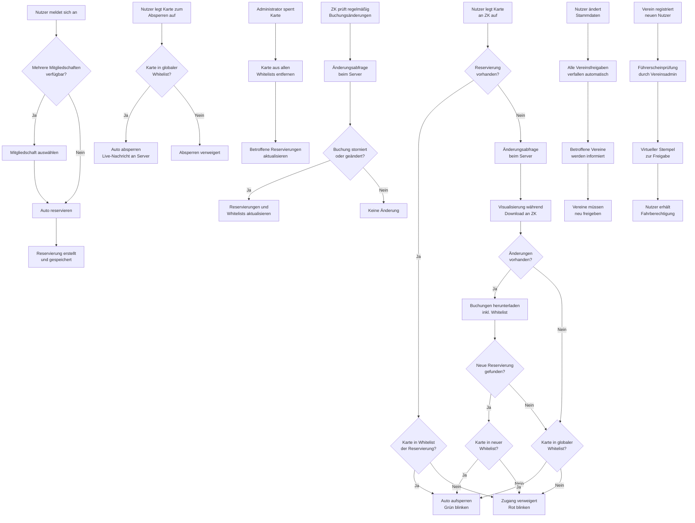

---
thema: Prozesse
typ: sonstiges
kategorie: allgemein
schlagworte: []
letzte_aktualisierung: 2026-05-14
---

## Themenüberblick

Die Prozessdiskussion umfasst verschiedene Aspekte der Systemsynchronisation und Nutzerverwaltung im Car-Sharing-System. Bei der Synchronisation zwischen Sharepad und Zugangskontrolle zeigt die Analyse historischer Buchungsdaten, dass bei stündlicher Synchronisation 90% der Buchungen erfasst werden, während bei fünfminütlicher Synchronisation 98,7% erreicht werden. Die Entscheidung über das optimale Synchronisationsintervall hängt von der Serverbelastung und dem Stromverbrauch ab. Für die Nutzerverwaltung wurde entschieden, dass neue Benutzer ausschließlich durch den Verein angelegt werden, um die Führerscheinprüfung und Kartenvergabe zu gewährleisten. Das Berechtigungskonzept sieht vor, dass Nutzer automatisch die Anwender-Rolle erhalten, während Administrator- und Super-User-Rollen vereinsspezifisch vergeben werden. Bei Änderungen von Stammdaten verfallen alle Vereinsfreigaben automatisch und müssen neu erteilt werden, wobei betroffene Vereine über Änderungen informiert werden.

**Schlagworte:** Synchronisation, Buchungsdaten, Nutzerverwaltung, Führerscheinprüfung, Berechtigungskonzept, Stammdaten, Vereinsfreigaben, Kartenvergabe, Polling-Frequenz, Whitelist

## Prozessbeschreibung

## Mermaid-Prozessdiagramm

## Prozessübersicht

Das System umfasst drei Hauptprozesse der Fahrzeugzugangskontrolle: die Fahrzeugbuchung über das Backend, das Aufsperren von Fahrzeugen mit Kartenvalidierung und das Absperren mit entsprechender Protokollierung. Diese Prozesse arbeiten zusammen, um eine sichere und nachvollziehbare Fahrzeugnutzung zu gewährleisten. Zusätzlich werden Prozesse für die Nutzerverwaltung, Führerscheinvalidierung und Berechtigungszuweisung definiert.

## Prozessschritte

### Fahrzeugbuchung (Use Case 1)
Der Buchungsprozess beginnt mit der Nutzeranmeldung im System. Nach erfolgreicher Authentifizierung wählt der Nutzer die gewünschte Mitgliedschaft aus, falls mehrere verfügbar sind (beispielsweise private und gewerbliche Mitgliedschaft). Das System erstellt anschließend eine Reservierung mit den Parametern Nutzer, Mitglied, Zeitraum und Fahrzeug. Diese Buchungsdaten werden in der Datenbank gespeichert und stehen der Zugangskontrolle zur Verfügung.

### Fahrzeug aufsperren (Use Case 2)
Der Aufsperrprozess startet mit der Kartenprüfung gegen die lokale Whitelist der aktuellen Reservierung. Bei vorhandener Reservierung und gültiger Karte wird das Fahrzeug entsperrt. Fehlt eine lokale Reservierung, führt das System eine Änderungsabfrage beim Server durch, um neue Buchungen zu ermitteln. Nur bei vorhandenen Änderungen werden die Buchungsdaten heruntergeladen, um Datenvolumen zu sparen. Während des Downloads wird eine Visualisierung an der Zugangskontrolle angezeigt (rotierende LED-Anzeige). Bei Netzwerkausfall greift das System auf die globale Whitelist als Fallback-Mechanismus zurück. Das Ergebnis wird durch entsprechende LED-Signale kommuniziert: zweimaliges grünes Blinken bei Erfolg, zweimaliges rotes Blinken bei Ablehnung.

### Fahrzeug absperren (Use Case 3)
Das Absperren ist auf Karten der globalen Whitelist beschränkt, um Missbrauch zu verhindern. Nach erfolgreicher Kartenvalidierung wird das Fahrzeug gesperrt und eine Live-Nachricht an das Backend gesendet. Diese Echtzeitübertragung ermöglicht dem System die sofortige Reaktion auf Überziehungen oder Buchungsverlängerungen.

### Reservierungsaktualisierung und Synchronisation
Die Zugangskontrolle aktualisiert Reservierungsdaten zeitgesteuert vor Buchungsbeginn (15 Minuten vorher) und in regelmäßigen Abständen während aktiver Buchungen. Das System implementiert verschiedene Synchronisationsintervalle: Bei stündlicher Synchronisation werden 90% der Buchungen erfasst, bei halbstündlicher 93%, bei viertelstündlicher 96% und bei fünfminütlicher Synchronisation 98,7%. Die Wahl des Intervalls erfolgt basierend auf dem Verhältnis zwischen Datenaktualität und Systemlast.

### Nutzerverwaltung und Registrierung
Die Erfassung neuer Benutzer und deren Zuordnung zu Mitgliedern erfolgt ausschließlich durch entsprechend berechtigte Vereinsmitarbeiter. Eine Selbstregistrierung durch Nutzer ist nicht vorgesehen, da jeder Nutzer eine persönliche Führerscheinprüfung durch den Verein benötigt. Das System trennt zwischen Login-Daten (E-Mail und Passwort), Nutzerdaten und vereinsspezifischen Führerscheinfreigaben.

### Führerscheinvalidierung und Freigabeprozess
Jeder Verein hat Administratoren, die Führerscheindaten mit virtueller Unterschrift freigeben. Bei Änderungen von Stammdaten verfallen automatisch alle bestehenden Vereinsfreigaben und müssen neu erteilt werden. Betroffene Vereine werden über Datenänderungen informiert, um eine zeitnahe Neufreigabe zu ermöglichen. Das System protokolliert alle Änderungen an Stammdaten für Nachvollziehbarkeit.

### Rollenvergabe und Berechtigungsmanagement
Nutzer erhalten automatisch die Anwender-Rolle. Super-User- oder Administrator-Rechte werden vereinsspezifisch durch Aufnahme in vereinsgepflegte Listen vergeben. Vereinsangestellte ohne Mitgliedschaft erhalten Berechtigungen über spezielle Orga-Mitgliedschaften des Vereins. Bei Entfernung aus allen Mitgliedschaften erlöschen automatisch alle erweiterten Berechtigungen.

## Beteiligte

**Nutzer**: Führen Buchungen durch und bedienen die Zugangskontrolle mit ihren Chipkarten. Können ihre Stammdaten einsehen, Änderungen erfolgen jedoch über den Verein.

**Zugangskontrolle (ZK)**: Validiert Karten, verwaltet Whitelists und steuert die Fahrzeugzugriffe. Führt regelmäßige Synchronisation mit dem Backend durch.

**Backend-System (Sharepad)**: Verwaltet Reservierungen, Nutzerdaten und verarbeitet Live-Nachrichten der Zugangskontrolle. Stellt Änderungsabfragen für optimierte Synchronisation bereit.

**Vereinsadministratoren**: Pflegen Stammdaten, führen Führerscheinprüfungen durch, verwalten Kartensperrungen und überwachen das System. Vergeben vereinsspezifische Berechtigungen und führen Freigabeprozesse durch.

**Super-User**: Haben erweiterte Verwaltungsrechte für vereinsspezifische Aufgaben und werden durch Vereinsadministratoren bestimmt.

## Besonderheiten

Das System implementiert eine mehrstufige Fallback-Strategie bei Verbindungsproblemen: lokale Whitelist, Serverabfrage und globale Whitelist. Kulanzzeiten von fünf Minuten vor und nach Buchungsterminen kompensieren Uhrenabweichungen. Die optimierte Synchronisation reduziert Datenvolumen durch Änderungsabfragen vor dem Download vollständiger Buchungsdaten.

Bei Stammdatenänderungen verfallen alle Vereinsfreigaben automatisch, um Sicherheit zu gewährleisten. Betroffene Vereine werden über Änderungen informiert, um zeitnahe Neufreigaben zu ermöglichen. Das System unterstützt Nutzer bei mehreren Vereinen, wobei jeder Verein separate Führerscheinfreigaben verwaltet.

Die Kartensperrung durch Administratoren erfordert die Aktualisierung aller betroffenen Reservierungen und Whitelists. Bei Überziehungen erfolgt eine automatische Benachrichtigung per SMS, während das System flexibel auf vereinsspezifische Regelungen reagieren kann. Vereinsangestellte ohne Mitgliedschaft erhalten Systemzugang über spezielle Orga-Mitgliedschaften des Vereins.

## Prozessübersicht

Das System umfasst drei Hauptprozesse der Fahrzeugzugangskontrolle: die Fahrzeugbuchung über das Backend, das Aufsperren von Fahrzeugen mit Kartenvalidierung und das Absperren mit entsprechender Protokollierung. Diese Prozesse arbeiten zusammen, um eine sichere und nachvollziehbare Fahrzeugnutzung zu gewährleisten.

## Prozessschritte

### Fahrzeugbuchung (Use Case 1)
Der Buchungsprozess beginnt mit der Nutzeranmeldung im System. Nach erfolgreicher Authentifizierung wählt der Nutzer die gewünschte Mitgliedschaft aus, falls mehrere verfügbar sind (beispielsweise private und gewerbliche Mitgliedschaft). Das System erstellt anschließend eine Reservierung mit den Parametern Nutzer, Mitglied, Zeitraum und Fahrzeug. Diese Buchungsdaten werden in der Datenbank gespeichert und stehen der Zugangskontrolle zur Verfügung.

### Fahrzeug aufsperren (Use Case 2)
Der Aufsperrprozess startet mit der Kartenprüfung gegen die lokale Whitelist der aktuellen Reservierung. Bei vorhandener Reservierung und gültiger Karte wird das Fahrzeug entsperrt. Fehlt eine lokale Reservierung, führt das System eine Einzelabfrage beim Server durch, um neue Buchungen zu ermitteln. Während des Downloads wird eine Visualisierung an der Zugangskontrolle angezeigt (rotierende LED-Anzeige). Bei Netzwerkausfall greift das System auf die globale Whitelist als Fallback-Mechanismus zurück. Das Ergebnis wird durch entsprechende LED-Signale kommuniziert: zweimaliges grünes Blinken bei Erfolg, zweimaliges rotes Blinken bei Ablehnung.

### Fahrzeug absperren (Use Case 3)
Das Absperren ist auf Karten der globalen Whitelist beschränkt, um Missbrauch zu verhindern. Nach erfolgreicher Kartenvalidierung wird das Fahrzeug gesperrt und eine Live-Nachricht an das Backend gesendet. Diese Echtzeitübertragung ermöglicht dem System die sofortige Reaktion auf Überziehungen oder Buchungsverlängerungen.

### Reservierungsaktualisierung
Die Zugangskontrolle aktualisiert Reservierungsdaten zeitgesteuert vor Buchungsbeginn (15 Minuten vorher) und in regelmäßigen Abständen während aktiver Buchungen. Dies gewährleistet die Berücksichtigung von Stornierungen und Änderungen ohne permanente Serveranfragen bei jeder Nutzerinteraktion.

## Beteiligte

**Nutzer**: Führen Buchungen durch und bedienen die Zugangskontrolle mit ihren Chipkarten.

**Zugangskontrolle (ZK)**: Validiert Karten, verwaltet Whitelists und steuert die Fahrzeugzugriffe.

**Backend-System (Sharepad)**: Verwaltet Reservierungen, Nutzerdaten und verarbeitet Live-Nachrichten der Zugangskontrolle.

**Administratoren**: Pflegen Stammdaten, verwalten Kartensperrungen und überwachen das System.

## Besonderheiten

Das System implementiert eine mehrstufige Fallback-Strategie bei Verbindungsproblemen: lokale Whitelist, Serverabfrage und globale Whitelist. Kulanzzeiten von fünf Minuten vor und nach Buchungsterminen kompensieren Uhrenabweichungen. Die Kartensperrung durch Administratoren erfordert die Aktualisierung aller betroffenen Reservierungen und Whitelists. Bei Überziehungen erfolgt eine automatische Benachrichtigung per SMS, während das System flexibel auf vereinsspezifische Regelungen reagieren kann. Die Nutzer-Selbstregistrierung ermöglicht die Zuordnung zu mehreren Vereinen über QR-Code-Verknüpfung.

---

## Quellen

| Datum | Thema | Transkript |
|-------|-------|------------|
| 2026-04-02 | Prozesse | [Transkript](../../../.doku-arbeitsbereich/2026-04-02_Abstimmung-2026-04-02/transkript/transkript_2026-04-02.md) |
| 2026-04-13 | Prozesse | [Transkript](../../../.doku-arbeitsbereich/2026-04-13_Abstimmung-2026-04-13/transkript/transkript_2026-04-13.md) |
